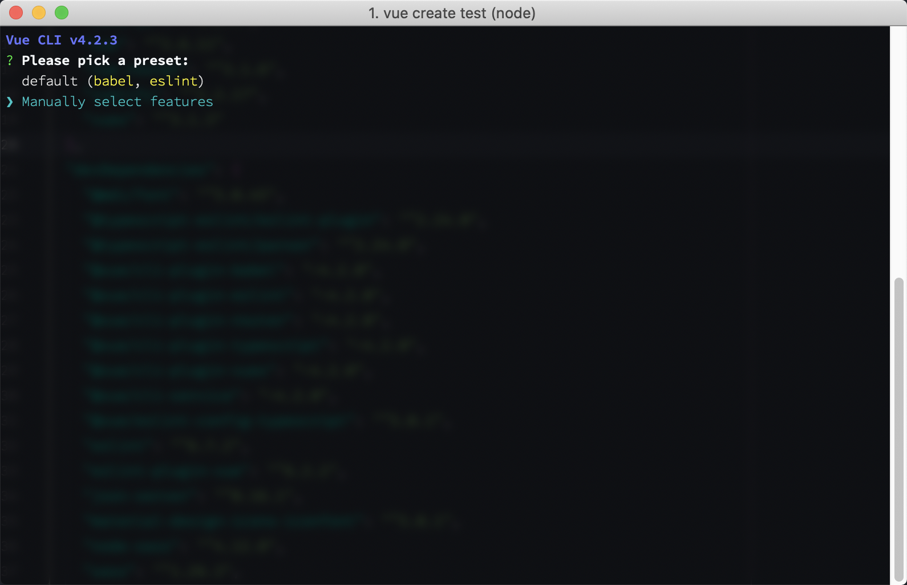
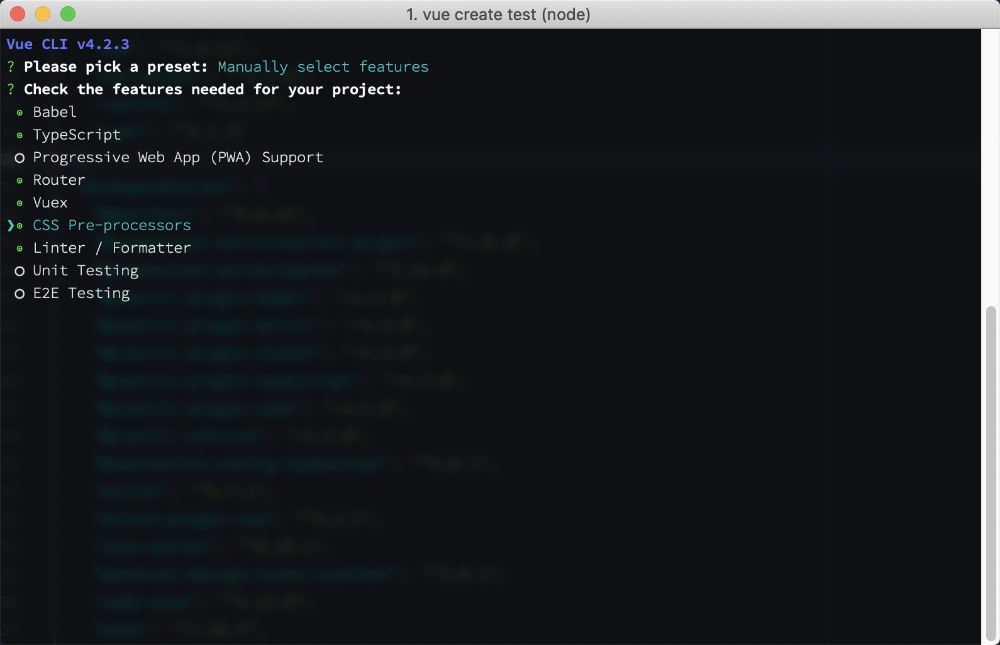
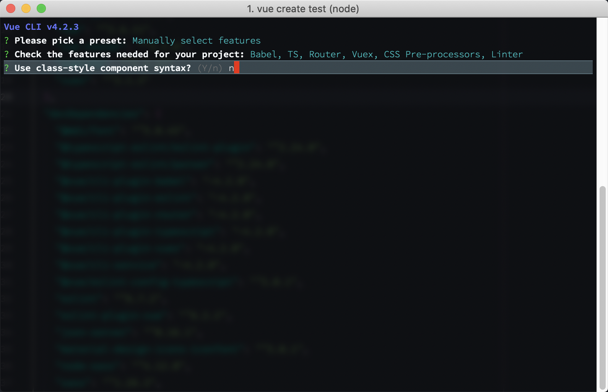
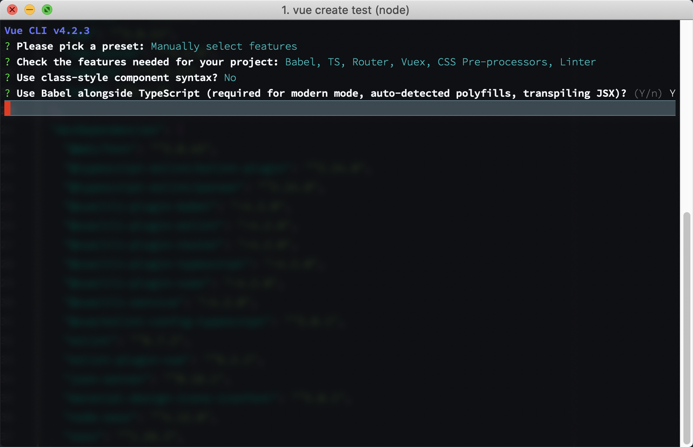
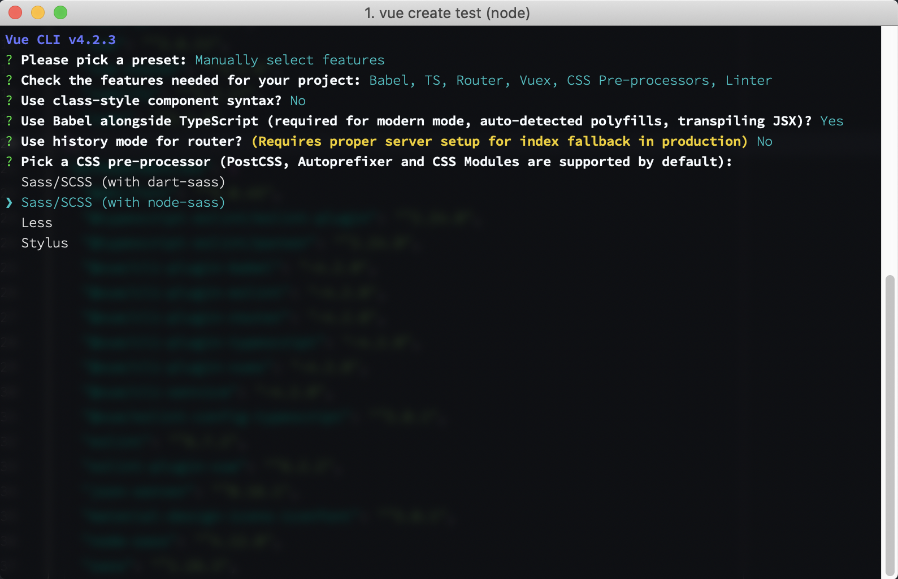
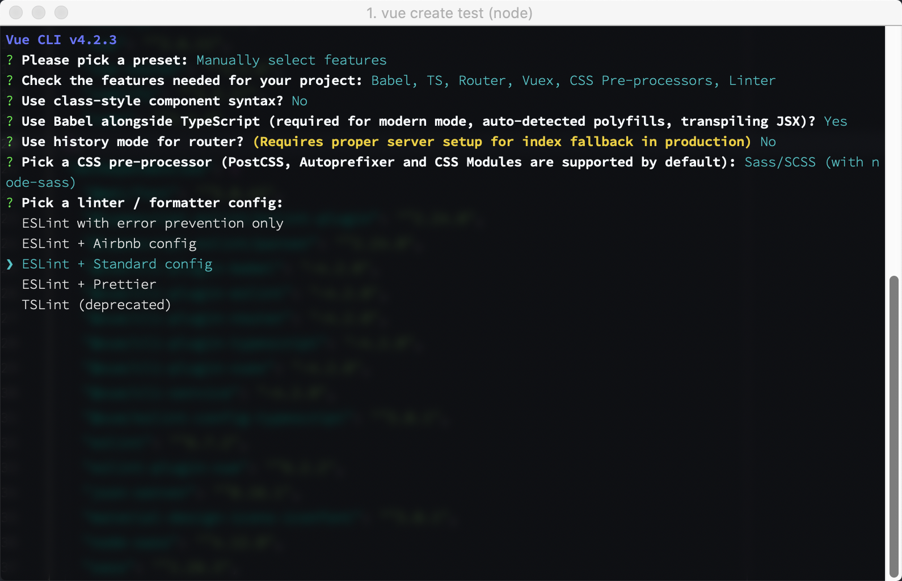
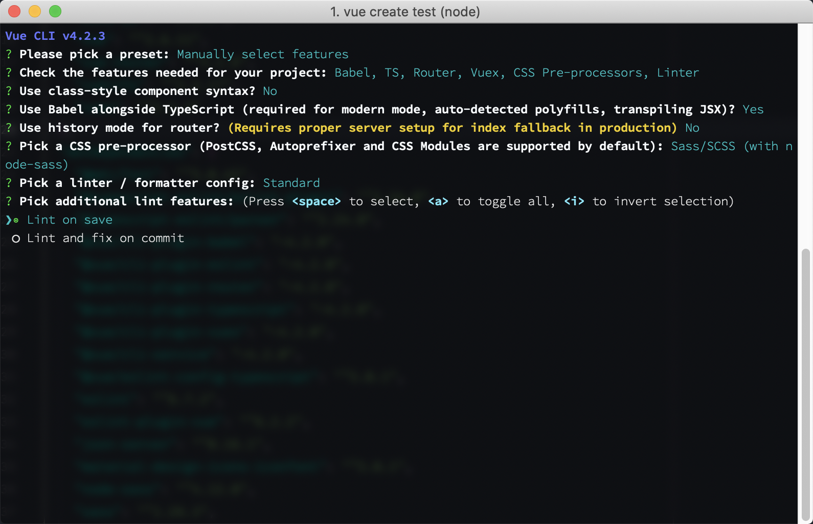
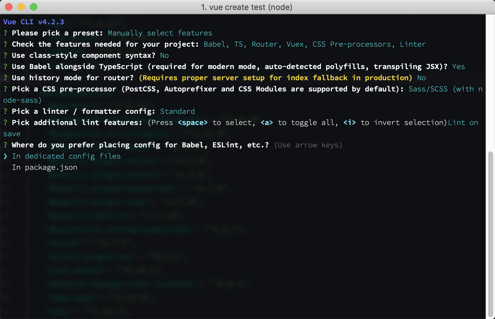

# Vue and TypeScript

This talk is to share my experiences utilizing TypeScript in a Vue app for the first time.

## Set up

Before we can go any further, we need to discuss set up. The setup I am about to present is one that I use most often, now with the addition of TypeScript.

The best way to set up a Vue app is to use the Vue CLI. Be sure to install the CLI globally, you are going to use it for every new project. `npm install -g @vue/cli`. Once that is installed you can start a new project by running `vue create some-app`.

Here are the options I have chosen when setting up my latest project. 

### Select Manual Option
We need to select Manual option to activate TypeScript



### Choose Options

In any given project, I have Babel, Router, Vuex, CSS Pre-Processors, and Linters. TypeScript is a new option to my setup.



### Class Base Component

I choose not to use Class Based Components because it seems to take away the spirit of the Vue object that I originally liked.



### Use Babel

Babel is always a good idea to have on.



### Router Mode

I personally don't mind the hash to be in the URL, so I leave that on for now. 


### Pre-processors

Gotta have my Sass. ( I should really try out Dart-Sass one day, but for now Node-Sass is good. )



### Linter

It's a good idea to set these up at the beginning of a project. 



### Linter Timing

I prefer to lint on save



### Rule Location

I prefer dedicated files for my configurations.



## Initial Differences

At first glance, the immediate things I noticed were all the `.js` files changed to `.ts` files, some `.vue` files have new syntax, two shim files, and the project has a `tsconfig.json` file.

### The .ts extension

In `.scss` extensions, any valid css code is acceptable in this file format. The same is true with a `.ts` extension. While looking through any of the files, there is no special TypeScript features included by default. It wasn"t until opening up the `HelloWorld.vue` component that I saw anything different in the file.

### Vue Components

The two differences in a `.vue` file is the script section. The tag itself has a `lang="ts"` property set, and the export extends the Vue class. 

```HTML
<script lang="ts">
import Vue from "vue";

export default Vue.extend({
  name: "HelloWorld"
});
</script>
```

### The shim files

After doing a little research, the `shims-vue.d.ts` file helps your IDE understand what a file ending in `.vue` is. While the `shims-tsx.d.ts` helps jsx syntax support, allowing you to write JSX-style TypeScript code.

### The tsconfig.json file

The `tsconfig.json` file is an important file. This gives the engine all it needs to know about the project and where to find it. We will be visiting this file again when we want to add paths or third party libraries.

```JSON
{
  "compilerOptions": {
    "target": "esnext",
    "module": "esnext",
    "strict": true,
    "jsx": "preserve",
    "importHelpers": true,
    "moduleResolution": "node",
    "esModuleInterop": true,
    "allowSyntheticDefaultImports": true,
    "sourceMap": true,
    "baseUrl": ".",
    "types": ["webpack-env"],
    "paths": {
      "@/*": ["src/*"]
    },
    "lib": ["esnext", "dom", "dom.iterable", "scripthost"]
  },
  "include": ["src/**/*.ts", "src/**/*.tsx", "src/**/*.vue", "tests/**/*.ts", "tests/**/*.tsx"],
  "exclude": ["node_modules"]
}
```

## Vue Router

Outside of the file extension getting changed to `.ts`, I have not noticed or done anything differently in these files. 

```JavaScript
import Vue from "vue";
import VueRouter from "vue-router";

Vue.use(VueRouter);

const routes = [
  {
    path: "/",
    name: "Home",
    component: () => import(/* webpackChunkName: "home" */"../views/Home.vue")
  },
  {
    path: "/about",
    name: "About",
    component: () => import(/* webpackChunkName: "about" */"../views/About.vue")
  }
];

const router = new VueRouter({
  routes
});

export default router;
```

## Vuex

Vuex is has gotten a bit more complex. You interact with it the same exact way, but now we need to split the files up and add types to everything. Let"s start with the stores `index.ts` file. In my app"s, I like everything to be their own store with a name space and very little in the global state. 

### Index and RootState

```JavaScript
// store/index.ts
import Vue from "vue";
import Vuex, { StoreOptions } from "vuex";
import { RootState } from "./RootState";
import { user } from "./user";
Vue.use(Vuex);

const store: StoreOptions<RootState> = {
  state: {
    version: "1.0.0",
  },
  modules: {
    user,
  },
};
export default new Vuex.Store<RootState>(store);
```

```JavaScript
// store/RootState.ts
export interface RootState {
  version: string;
}
```

### User Interface

We need to create an interface for a User, then let"s create the files for actions, getters, actions, and mutations.

```JavaScript
// interfaces/user.d.ts
export interface User {
  name: string;
  email: string;
  profileImage?: string;
}

export interface UserState {
  currentState: string;
  isLoggedIn: boolean;
  lastActive: string;
  user: User;
}
```

### User Module Index

In normal Vuex, we declare a state object and assign it some values. This limits us from using types, so we have to declare variables and assign that to the state. Let"s look at an example of the old way before seeing the TypeScript way.

```JavaScript
export const state = {
  isLoggedIn: false,
  lastActive: "yesterday",
  user: {
    name: "jerm",
    email: "jerm@jerm.jerm",
    profileImg: null
  }
}
```

With the old way, you don't get any type safety. With TypeScript, it's a little more involved but worth the extra effort.

```JavaScript
// store/user/state
import { User, UserState } from "@/interfaces/user";

const user: User = {
  name: "jerm",
  email: "jerm@jerm.jerm"
};

export const state: UserState = {
  currentState: "NOT_LOADED",
  isLoggedIn: false,
  lastActive: "yesterday",
  user
};
```

### Getters

It's a common pattern to use getters to get specific information from the state without having to reference the state and dive into nested objects. Since all the key"s on this object are methods, we can add directly to the return object. Each method should have a return value as getters only return values. Let"s look at the user getter file to get specific information.

```JavaScript
// store/user/getters
import { GetterTree } from "vuex";
import { UserState } from "@/interface/user";
import { RootState} from "../RootState";

export const getters: GetterTree<UserState, RootState> = {
  getName({user}): string {
    return user.name
  },
  isUserLoggedIn(state): boolean {
    return state.isLoggedIn
  }
}
```

### Actions

Actions are where we preform async tasks. Things like saving to a database, or writing to local storage, or anything that requires multiple steps. Like getters, these can be added to the object directly as they are methods. 

```JavaScript
// store/user/actions
import { ActionTree } from "vuex";
import { UserState } from "@/interface/user";
import { RootState} from "../RootState";

export const actions: ActionTree<InterviewState, RootState> = {
  async saveToLocal({state, commit}): void {
    commit("SET_STATUS", "SAVING_DATA");
    await storage.setItem("user", JSON.stringify(state.user));
    commit("UPDATE_ACTIVE_STAMP", date.now());
    commit("SET_STATUS", "SAVED");
  }
}
```

### Mutations

Mutations are pretty straight forward. They are called from actions and generally should only do one thing per function.

```JavaScript
// store/user/mutations
import { MutationTree } from "vuex";
import { UserState } from "@/interface/user";
import { RootState} from "../RootState";

export const mutations: MutationTree<InterviewState> = {
  SET_STATUS(state, status: string): void {
    state.status = status;
  },
  UPDATE_ACTIVE_STAMP(state, time: string): void {
    state.lastActive = time;
  }
}
```

### Store Index

Tying this all together in the user module `index.ts`.

```JavaScript
// store/user/index
import { Module } from "vuex";
import { RootState } from "../RootState";
import { UserState } from "@/interfaces/user";
import { state } from "./state";
import { getters } from "./getters";
import { actions } from "./actions";
import { mutations } from "./mutations";

export const interview: Module<UserState, RootState> = {
  namespaced: true,
  state,
  getters,
  actions,
  mutations,
};
```


## Vue and TS Config Files

One of the first things I figured out in a normal Vue set up, was how to get aliasing working. Nested components and relative paths is a recipe for disaster. With just the Vue Config aliasing you lose the traceability of a file. Meaning, you can no longer click an import link and follow it to its correct location. As well as you lose good auto import functionality. These were issues but something I dealt with as relative paths presented bigger issues for me at the time. 

Along comes TSConfig file and we can have the best of both worlds, custom aliases and intellisense! You just have to make sure both config files have the same paths and tell the TSConfig file where to look.

### Vue Config File

Let's look at a potential set up for a Vue file. ( Please note, I am not going into all the possibilities with Vue Config, I am just showing aliasing. )

```JavaScript
const path = require("path");

module.exports = {
  chainWebpack: config => {
    config.resolve.alias.set("@", path.resolve("src"));
    config.resolve.alias.set("@comps", path.resolve("src/components"));
    config.resolve.alias.set("@views", path.resolve("src/views"));
    config.resolve.alias.set("@services", path.resolve("src/services"));
    config.resolve.alias.set("@interfaces", path.resolve("src/interfaces"));
  }
};
```

The set method on the config resolver takes two arguments. What is the string as it will replace, and what is the path it will replace it with. You can now refer to a component, view, service, or interface from any where in your application without having to figure out how many folders to go up or down.

```HTML
<script lang="ts">
import Vue from "vue";
import Header from "@comps/common/ui/header";
// vs
// import Header from "../../../../common/ui/Header";

export default Vue.extend({
  name: "HelloWorld",
  components: {
    Header
  }
});
</script>
```

### TS Config

Aliases are amazing! Though I do miss the intellisense and auto complete features. Let's re-examine the `tsconfig.json` file and see how we can enhance it to be more useful.\

```JSON
{
  "compilerOptions": {
    ...
    "paths": {
      "@/*": ["src/*"],
      "@comps/*": ["components/*.vue"],
      "@views/*": ["views/*.vue"],
      "@services/*": ["services/*.ts"],
      "@interfaces/*": ["interfaces/*.ts"],
    },
    ...
  },
  ...
}
```

Now when trying to call import something manually, you can refer to the `@alias/` and have the auto complete kick in. The auto import also has helpful suggestions as well, but it will add the relative path. ( Not sure if this is something that can be fixed or even if its a big deal. )

#### CAUTION ALERT

Since this is a Vue application trying to be a TypeScript application, you need to specify the file type that alias is expecting. Otherwise it will assume `.ts` extension and will cause all sorts of errors, both in linting and compiling.