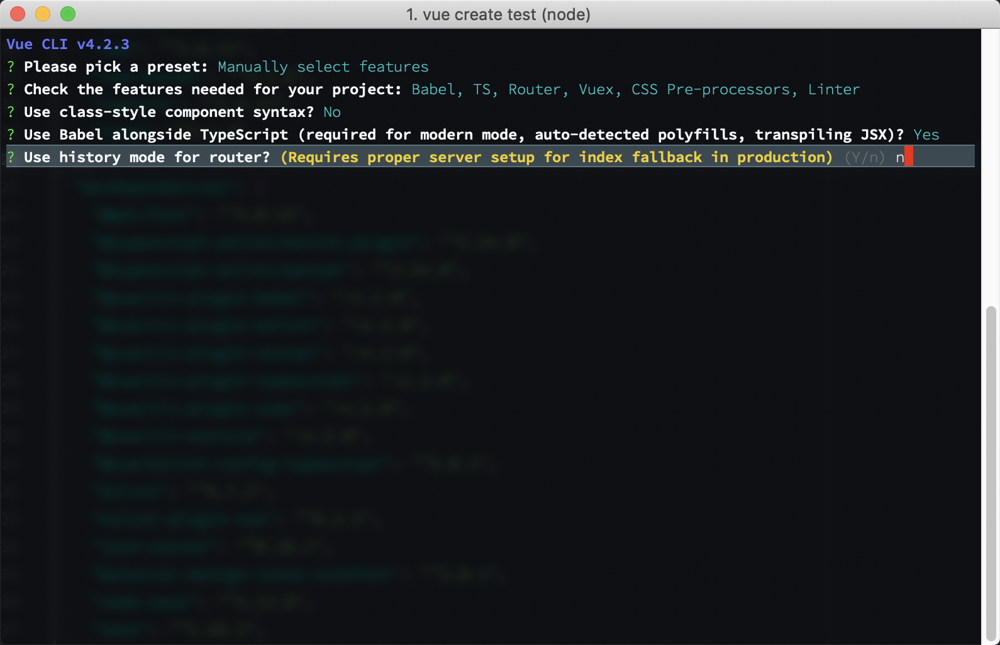

# Vue and TypeScript

This talk is to share my experiences utilizing TypeScript in a Vue app for the first time.

## Set up

Before we can go any further, we need to discuss set up. The setup I am about to present is one that I use most often, now with the addition of TypeScript.

The best way to set up a Vue app is to use the Vue CLI. Be sure to install the CLI globally, you are going to use it for every new project. `npm install -g @vue/cli`. Once that is installed you can start a new project by running `vue create some-app`.

Here are the options I have chosen when setting up my latest project. 

### Select Manual Option
We need to select Manual option to activate TypeScript


### Choose Options

In any given project, I have Babel, Router, Vuex, CSS Pre-Processors, and Linters. TypeScript is a new option to my setup.


### Class Base Component

I choose not to use Class Based Components because it seems to take away the spirit of the Vue object that I originally liked.


### Use Babel

Babel is always a good idea to have on.


### Router Mode

I personally don't mind the hash to be in the URL, so I leave that on for now. 



### Pre-processors

Gotta have my Sass. ( I should really try out Dart-Sass one day, but for now Node-Sass is good. )


### Linter

It's a good idea to set these up at the beginning of a project. 


### Linter Timing

I prefer to lint on save


### Rule Location

I prefer dedicated files for my configurations.


## Initial Differences

At first glance, the immediate things I noticed were all the `.js` files changed to `.ts` files, some `.vue` files have new syntax, two shim files, and the project has a `tsconfig.json` file.

### The .ts extension

In `.scss` extensions, any valid css code is acceptable in this file format. The same is true with a `.ts` extension. While looking through any of the files, there is no special TypeScript features included by default. It wasn"t until opening up the `HelloWorld.vue` component that I saw anything different in the file.

### Vue Components

The two differences in a `.vue` file is the script section. The tag itself has a `lang="ts"` property set, and the export extends the Vue class. 

```HTML
<script lang="ts">
import Vue from "vue"

export default Vue.extend({
  name: "HelloWorld"
});
</script>
```

### The shim files

After doing a little research, the `shims-vue.d.ts` file helps your IDE understand what a file ending in `.vue` is. While the `shims-tsx.d.ts` helps jsx syntax support, allowing you to write JSX-style TypeScript code.

### The tsconfig.json file

The `tsconfig.json` file is an important file. This gives the engine all it needs to know about the project and where to find it. We will be visiting this file again when we want to add paths or third party libraries.

```JSON
{
  "compilerOptions": {
    "target": "esnext",
    "module": "esnext",
    "strict": true,
    "jsx": "preserve",
    "importHelpers": true,
    "moduleResolution": "node",
    "esModuleInterop": true,
    "allowSyntheticDefaultImports": true,
    "sourceMap": true,
    "baseUrl": ".",
    "types": ["webpack-env"],
    "paths": {
      "@/*": ["src/*"]
    },
    "lib": ["esnext", "dom", "dom.iterable", "scripthost"]
  },
  "include": ["src/**/*.ts", "src/**/*.tsx", "src/**/*.vue", "tests/**/*.ts", "tests/**/*.tsx"],
  "exclude": ["node_modules"]
}
```

## Vue Router

Outside of the file extension getting changed to `.ts`, I have not noticed or done anything differently in these files. 

```JavaScript
import Vue from "vue";
import VueRouter from "vue-router";

Vue.use(VueRouter);

const routes = [
  {
    path: "/",
    name: "Home",
    component: () => import(/* webpackChunkName: "home" */"../views/Home.vue")
  },
  {
    path: "/about",
    name: "About",
    component: () => import(/* webpackChunkName: "about" */"../views/About.vue")
  }
];

const router = new VueRouter({
  routes
});

export default router;
```

